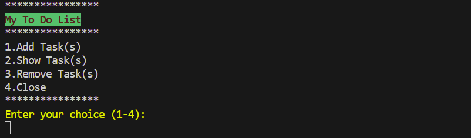
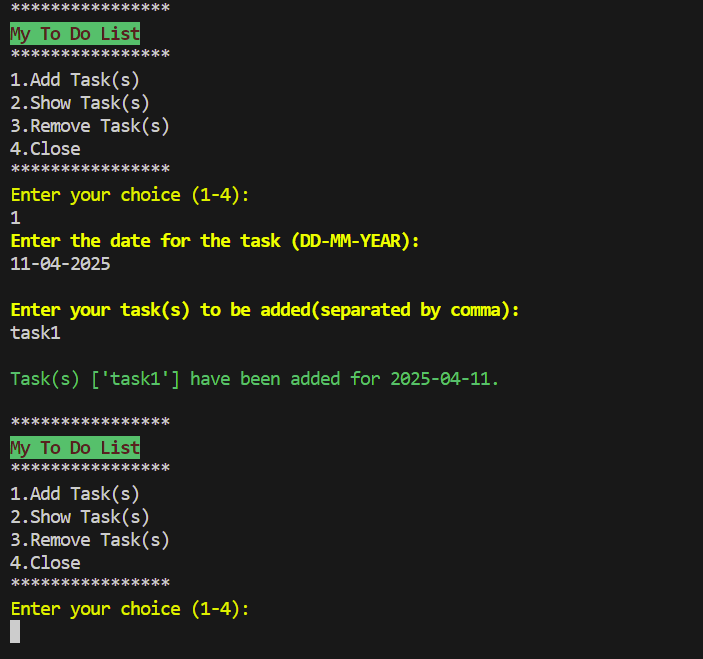
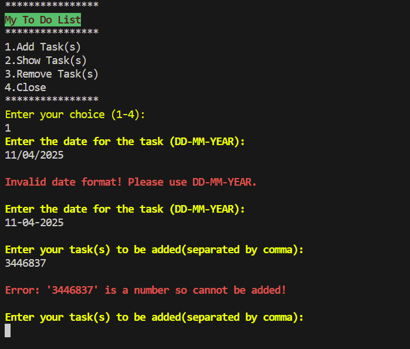
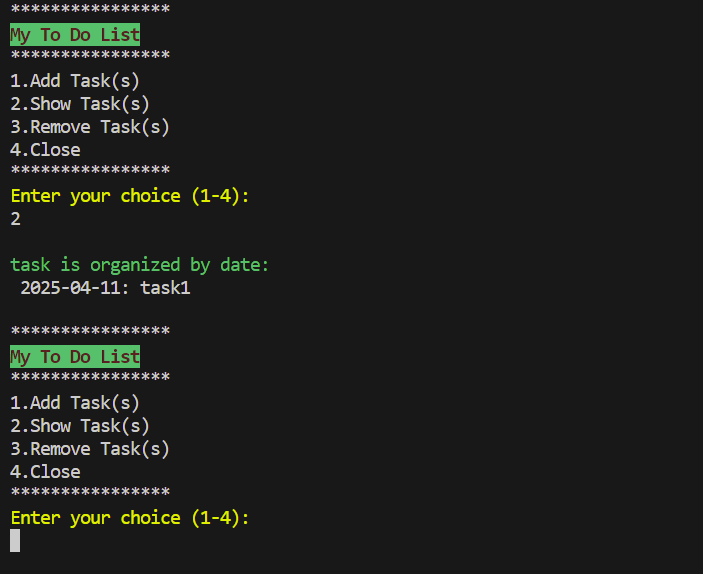
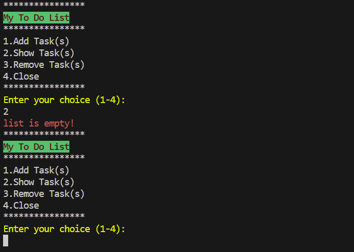
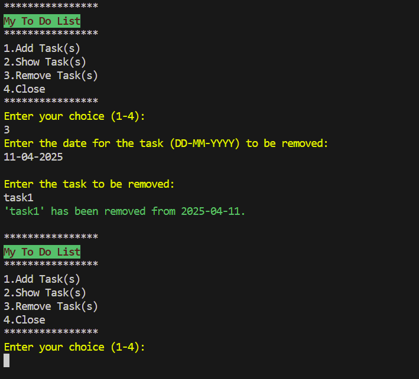
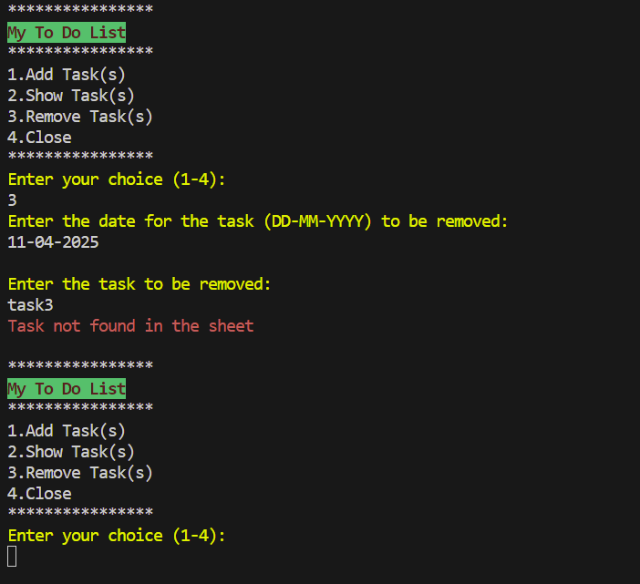

# To Do List

## Table of Contents

* [Introduction](#Introduction)
    * [Site Goals](#site-goals)
    * [Target Audience](#target-audience)
    * [User stories](#user-stories)
    * [Features Planned](#features-planned)
* [Structure]()

## Introduction

This project is designed for the people who want to manage daily tasks effortlessly, keeping track of what needs to be done on a daily basis.Perfect for breaking down large goals into smaller, actionable steps.

### Site Goals

* Design a simple yet efficient tool to stay organized and productive.

### Target Audience

* People looking to organize personal/professional goals, and plan to work on them accordingly.

### User Stories

* As a User, I would like to be able to easily find the various options on menu so that i can add / show / remove tasks.
* As a User, I would like to be able to manage task datewise so that i can add tasks for a particular date with ease.
* As a User, I would like to be able to view records so i can plan for the next task due.
* As a User, I would like to be able to remove the task when its not needed to be in the records anymore.
* As a User, I would like to be able to exit the application without having to close the browser.

### Features Planned

* Simple, easy-to-use application with clear navigation.
* Integrated Google Sheets storage for:
    * Add, view and delete tasks functionality.
* User friendly validation and error messages for smoother input handling.
* Functionality to remove tasks directly based on the date and task description.
* Option to exit the application at any time.

## Structure

### Features

USER STORY

`
As a User, I would like to be able to easily find the various options on menu so that i can add / show / remove tasks.
`

IMPLEMENTATION
* Main Menu
    * When the application starts, a main menu will appear with the following options:
         * 1 - Add Task(s)
         * 2 - Show Task(s)
         * 3 - Remove Task(s)
         * 4 - Close
    * The user must input a correct number corresponding to the main menu options. If an invalid choice is made, an error message will be displayed and the main menu will be shown again.

USER STORY

`
As a User, I would like to be able to manage task datewise so that i can add tasks for a particular date with ease.
`

IMPLEMENTATION
* Main Menu
  * Add Task
    * When the user selects Add Task(s) from the main menu, the following options will appear:
      * Enter the date for the task (DD-MM-YEAR) - 
      * Enter your task(s) to be added(separated by comma) - 
  * The user is required to provide the correct date format, when asked to enter the date. If an invalid format is entered, they will be prompted repeatedly until the correct format is provided.
  * The user is required to provide text strings only, when asked to enter the task.
  * Once both inputs are correctly provided, the user will receive confirmation that the task has been added for the selected date.

  Add Task menu

  

  * Add Task:- Incorrect data

  

  USER STORY

  `
  As a User, I would like to be able to view records so i can plan for the next task due.
  `

  IMPLEMENTATION
  * Main Menu
    * Show Task
      * When the user selects Show Task(s) from the main menu:-
        * the task list will be displayed.
        * If no tasks are present, an empty list will be shown instead.

    Show Task Menu

    

    Show Task menu :- empty list

    

    USER STORY

    `
    As a User, I would like to be able to remove the task when its not needed to be in the records anymore.
    `

    IMPLEMENTATION
    * Main Menu
      * Remove Task
        * When the user selects Remove Task(s) from the main menu, the following options will appear:
          * Enter the date for the task (DD-MM-YYYY) to be removed:
            * The user is required to provide the correct date format, when asked to enter the date. If an invalid format is entered, they will be prompted repeatedly until the correct format is provided.
          * Enter the task to be removed:
            * The user need to enter the task present in the list only.
        * Once both inputs are correctly provided, the user will receive confirmation that the selected task has been removed for the selected date.

    Remove Task Menu :-

    

    Remove Task Menu (Task Not Found):

    

         
   

<!-- 

Welcome,

This is the Code Institute student template for deploying your third portfolio project, the Python command-line project. The last update to this file was: **May 14, 2024**

## Reminders

- Your code must be placed in the `run.py` file
- Your dependencies must be placed in the `requirements.txt` file
- Do not edit any of the other files or your code may not deploy properly

## Creating the Heroku app

When you create the app, you will need to add two buildpacks from the _Settings_ tab. The ordering is as follows:

1. `heroku/python`
2. `heroku/nodejs`

You must then create a _Config Var_ called `PORT`. Set this to `8000`

If you have credentials, such as in the Love Sandwiches project, you must create another _Config Var_ called `CREDS` and paste the JSON into the value field.

Connect your GitHub repository and deploy as normal.

## Constraints

The deployment terminal is set to 80 columns by 24 rows. That means that each line of text needs to be 80 characters or less otherwise it will be wrapped onto a second line.

---

Happy coding! -->
