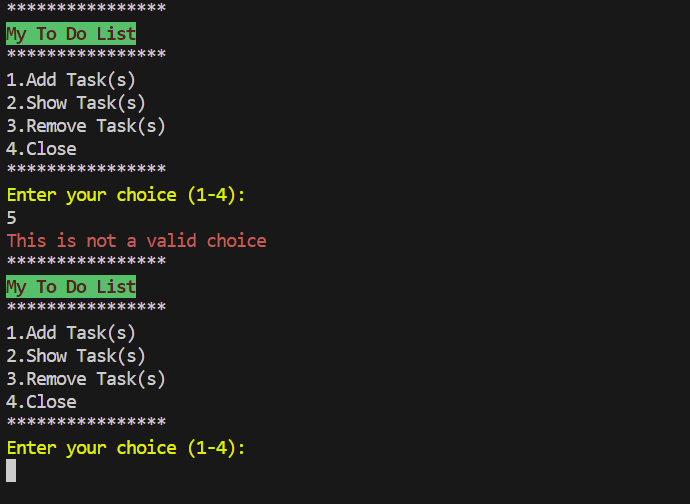
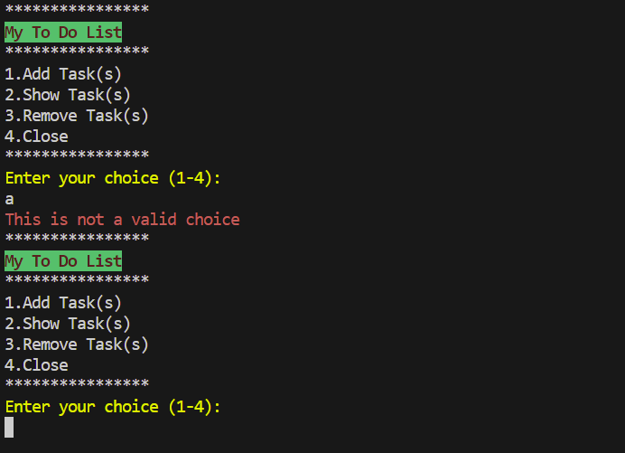
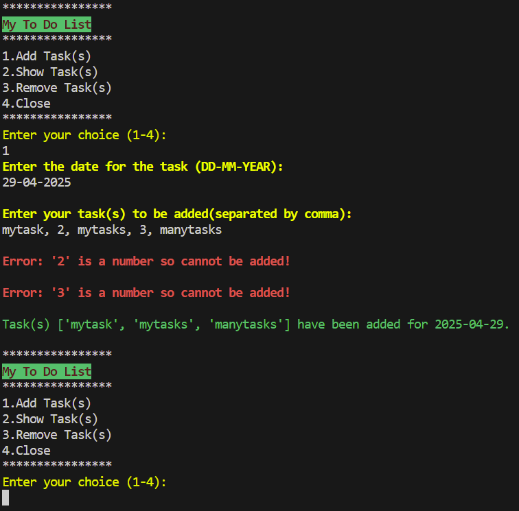
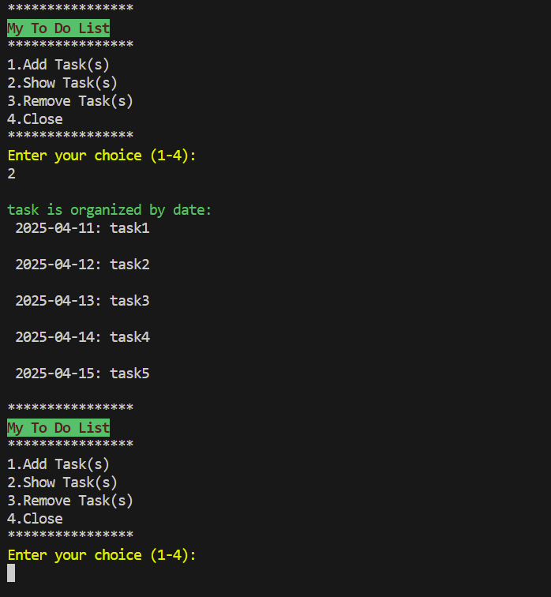
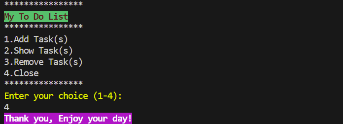
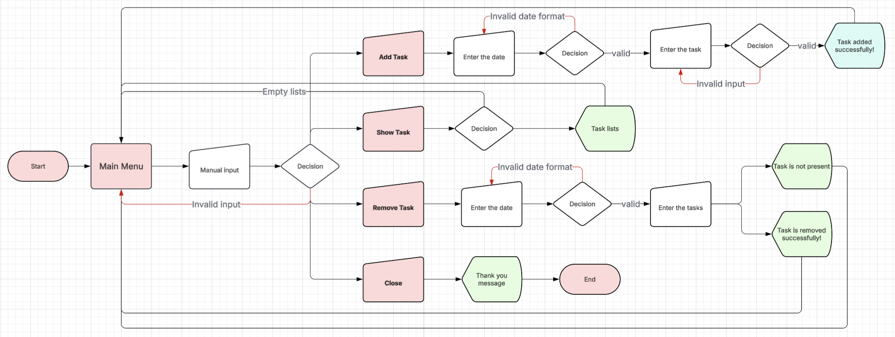
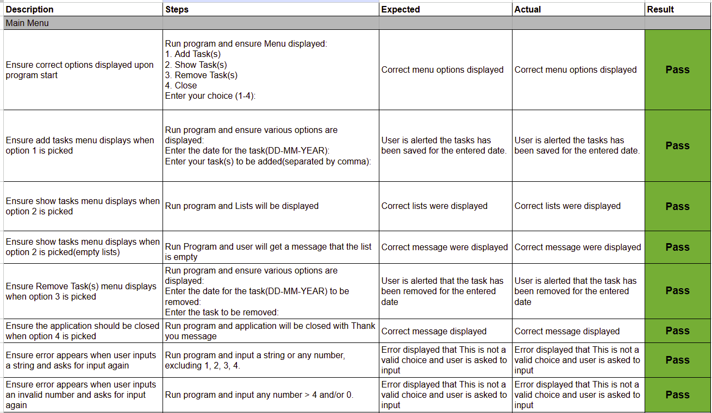
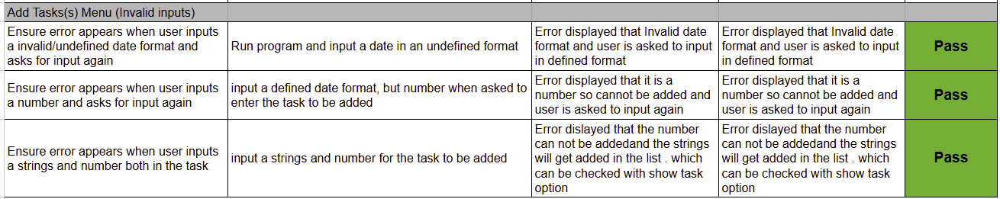
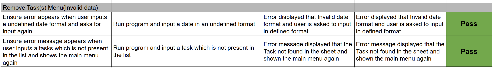
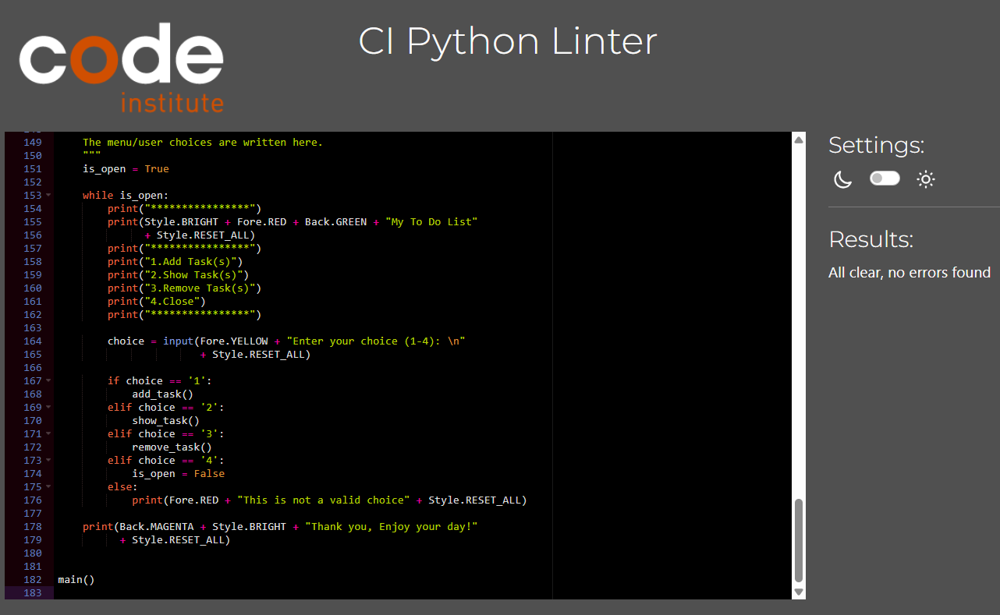

# To Do List


## Table of Contents

* [Introduction](#Introduction)
    * [Site Goals](#site-goals)
    * [Target Audience](#target-audience)
    * [User stories](#user-stories)
    * [Features Planned](#features-planned)
* [Structure](#structure)
    * [Features](#features)
    * [Features left to implement](#features-left-to-implement)
* [Logical Flow](#logical-flow)
* [Technologies](#technologies)
* [Testing](#testing)
    * [Functional Testing](#functional-testing)
    * [Pep8ci Validation](#pep8ci-validation)
    * [Bugs and Fixes](#bugs-and-fixes)
* [Deployment](#deployment)
    * [Version Control](#version-control)
    * [Google Sheet](#google-sheet)
    * [Heroku Deployment](#heruko-deployment)
    * [Clone Locally](#clone-locally)
* [Credits](#credits)
    * [Content](#contents)


## Introduction

This project is designed for the people who want to manage daily tasks effortlessly, keeping track of what needs to be done on a daily basis.Perfect for breaking down large goals into smaller, actionable steps.

### Site Goals

* Design a simple yet efficient tool to stay organized and productive.

### Target Audience

* People looking to organize personal/professional goals, and plan to work on them accordingly.

### User Stories

* As a User, I would like to be able to easily find the various options on menu so that i can add / show / remove tasks.
* As a User, I would like to be able to manage task datewise so that i can add tasks for a particular date with ease.
* As a User, I would like to be able to view records so i can plan for the next task due.
* As a User, I would like to be able to remove the task when its not needed to be in the records anymore.
* As a User, I would like to be able to exit the application without having to close the browser.

### Features Planned

* Simple, easy-to-use application with clear navigation.
* Integrated Google Sheets storage for:
    * Add, view and delete tasks functionality.
* User friendly validation and error messages for smoother input handling.
* Functionality to remove tasks directly based on the date and task description.
* Option to close the application in the main menu.

## Structure

### Features

USER STORY

`
As a User, I would like to be able to easily find the various options on menu so that i can add / show / remove tasks.
`

IMPLEMENTATION
* Main Menu
    * When the application starts, a main menu will appear with the following options:
         * 1 - Add Task(s)
         * 2 - Show Task(s)
         * 3 - Remove Task(s)
         * 4 - Close
    * The user must input a correct number corresponding to the main menu options. If an invalid choice is made, an error message will be displayed and the main menu will be shown again.


Main Menu - Invalid Choice





USER STORY

`
As a User, I would like to be able to manage task datewise so that i can add tasks for a particular date with ease.
`

IMPLEMENTATION
* Main Menu
  * Add Task
    * When the user selects Add Task(s) from the main menu, the following options will appear:
      * Enter the date for the task (DD-MM-YEAR) - 
      * Enter your task(s) to be added(separated by comma) - 
  * The user is required to provide the correct date format, when asked to enter the date. If an invalid format is entered, they will be prompted repeatedly until the correct format is provided.
  * The user is required to provide text strings only, when asked to enter the task.
  * Once both inputs are correctly provided, the user will receive confirmation that the task has been added for the selected date.

  Add Task menu

  

  * Add Task:- Incorrect data

  


  * Add Task:- Mixed data (strings and numbers)

  

  USER STORY

  `
  As a User, I would like to be able to view records so i can plan for the next task due.
  `

  IMPLEMENTATION
  * Main Menu
    * Show Task
      * When the user selects Show Task(s) from the main menu:-
        * the task list will be displayed.
        * If no tasks are present, an empty list will be shown instead.

    Show Task Menu

    

    Show Task Menu :- Multiple Tasks

    

    Show Task menu :- empty list

    

    USER STORY

    `
    As a User, I would like to be able to remove the task when its not needed to be in the records anymore.
    `

    IMPLEMENTATION
    * Main Menu
      * Remove Task
        * When the user selects Remove Task(s) from the main menu, the following options will appear:
          * Enter the date for the task (DD-MM-YYYY) to be removed:
            * The user is required to provide the correct date format, when asked to enter the date. If an invalid format is entered, they will be prompted repeatedly until the correct format is provided.
          * Enter the task to be removed:
            * The user need to enter the task present in the list only.
        * Once both inputs are correctly provided, the user will receive confirmation that the selected task has been removed for the selected date.

    Remove Task Menu :-

    

    Remove Task Menu (Task Not Found):

    

    USER STORY

    `
    As a User, I would like to be able to exit the application without having to close the browser.
    `

    IMPLEMENTATION
    * Main Menu
      * Close
        * When the user decides to close the application without making a selection from the main menu.
        * Upon entering the option "4", the user will receive a message thanking them.

    Close Menu:

    

    **Error Handling**

    Error handling was implemented throughout the application with the use of try/except statements to handle raised for things like, Value errors.

    ### Features Left to Implement

    As a future improvement, I plan to implement a feature that allows users to exit the application at any time by entering the keyword '0'.

    ## Logical Flow

    


    ## Technologies

    * Python - Python was the main language used to build the application.
    * Google Sheet - This was used as data storage in order to store the list of tasks.
    * Gspread - This was used to access and update data in spreadsheet.
    * Colorama - Colorama was used to add colored text and styling to terminal output.

    ## Testing

    ### Functional Testing

    Below are the text execution of positive functional tests:

    

    

    

    Negative input validation testing was performed on all menu options to ensure correct input. All options behaved as expected, alerting the user of invalid input and then asking for input again.

    ### Pep8ci Validation

    All python code was ran through https://pep8ci.herokuapp.com/ validator and any warnings or errors were fixed. Code then validated successfully.

    

    ### Bugs and Fixes

    Validation had to be added to ensure the latest date should show in the beginning of the list. as it was showing the latest tasks added in the list ignoring the date which needs prior attention.

    ## Deployment

    ### Version Control

    The site was created using the Visual Studio Code editor and pushed to github to the remote repository `to_do_list`.

    The following git commands were used throughout development to push code to the remote repo:

    ```git add <file>``` - This command was used to add the file(s) to the staging area before they are committed.

    ```git commit -m “commit message”``` - This command was used to commit changes to the local repository queue ready for the final step.

    ```git push``` - This command was used to push all committed code to the remote repository on github.

    ### Google sheet

    * Creating a spreadsheet in Google sheets:-
      * Log in with Google account and go to Google apps(on top right of the page).
      * Click on Drive and then on top left on the page click on 'New' and select Google sheets.
      * Blank spreadsheet will get open which can be renamed with desired name for the file.
      * Use the grid to enter your data into rows (horizontal) and columns (vertical).
      * Google Sheets saves automatically, so you don’t need to worry about losing your changes.
      * Click the "Share" button in the top-right to allow others to view or edit your spreadsheet.


    ### Heruko Deployment

    The below steps were followed to deploy this project to Heroku:

    * Go to Heroku and click to "create new app".
    * Choose an app name and region, click "Create app".
    * Go to "Settings" and navigate to Config Vars - Reveal Config Vars. Add the following config variables:
      * GOOGLE SHEET : KEY :- CREDS, VALUE :- Copy the json file and paste here, click on Add.
      * PORT : 8000
    * Navigate to Buildpacks and add buildpacks for Python and NodeJS (in that order).
    * Navigate to "Deploy". Set the deployment method to Github and enter repository name and connect.
    * Scroll down to Manual Deploy, select "main" branch and click "Deploy Branch".
    * The app will now be deployed to heroku.

    ### Clone Locally

    * Open IDE of choice and type the following into the terminal:
       * ```git clone https://github.com/Neelp20/to_do_list.git```
    * Project will now be cloned locally.

    Note: If you want to use the application, follow the steps provided for Google Sheet.

    ## Credits

    ### Contents

    [Create Date Range](https://www.geeksforgeeks.org/python-datetime-strptime-function/)

    [Flow Chart](https://www.lucidchart.com/pages)

    [Line too long](https://note.nkmk.me/en/python-long-string/)

    [Colorama](https://www.geeksforgeeks.org/introduction-to-python-colorama/)

    [sorting date in ascending order](https://www.w3schools.com/python/ref_list_sort.asp)
    
    * My Mentor Gareth McGirr for his guidance and support throughout my project.


